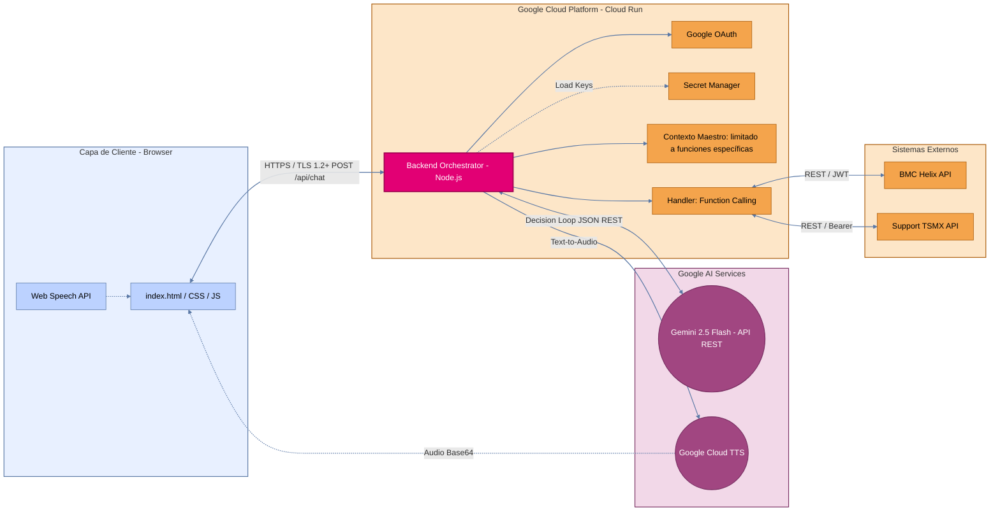
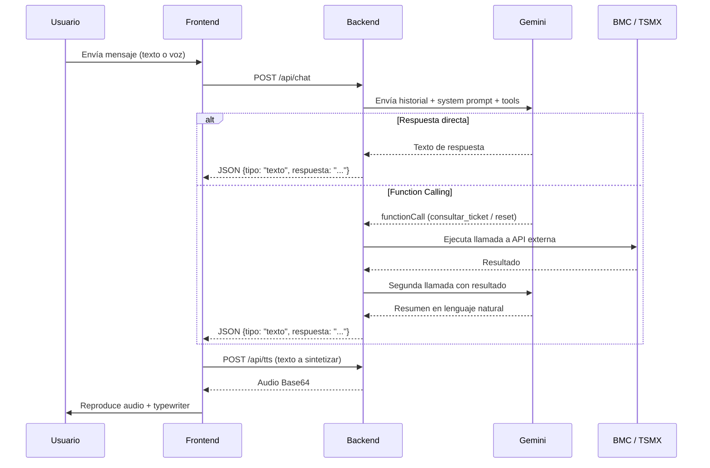

# Memoria Técnica — SOPHIA

**Asistente Virtual Corporativo de Soporte TI**
Versión 1.0 · Febrero 2026

---

## 1. Descripción General

SOPHIA (**S**oportec **O**perational **P**latform for **H**elpdesk **I**ntelligent **A**ssistance) es un asistente virtual corporativo especializado en ITSM (IT Service Management). Permite a los colaboradores de la organización:

- Consultar el estatus de tickets en **BMC Helix** en tiempo real.
- Ejecutar **reinicio y desbloqueo de contraseñas** a través de la API de Support TSMX (UM).
- Interactuar por **voz** (dictado y síntesis TTS) y por **texto**.
- Obtener asesoría sobre procesos de soporte de TI.

La solución está desplegada íntegramente dentro del ecosistema de **Google Cloud Platform**, dentro del tenant corporativo de la empresa, garantizando control total sobre la infraestructura, los datos y el acceso.

---

## 2. Diagrama de Componentes



---

## 3. Stack Tecnológico

| Capa | Tecnología | Versión |
|---|---|---|
| **Runtime** | Node.js | ≥ 18 |
| **Framework** | Express.js | 4.18.x |
| **Autenticación** | Passport.js + Google OAuth 2.0 | 0.7 / 2.0 |
| **Sesiones** | express-session (cookies seguras) | 1.17.x |
| **HTTP Client** | Axios | 1.6.x |
| **IA Conversacional** | Gemini 2.5 Flash (API REST) | v1beta |
| **Text-to-Speech** | Google Cloud TTS (Wavenet) | v1 |
| **Speech-to-Text** | Web Speech API (navegador) | Nativa |
| **Contenedor** | Docker (node:18-slim) | — |
| **Hospedaje** | Google Cloud Run | Fully managed |
| **Secretos** | Google Secret Manager | — |
| **Frontend** | HTML5 / CSS3 / Vanilla JS | — |

---

## 4. Arquitectura de Seguridad

> [!IMPORTANT]
> Toda la infraestructura está alojada dentro del **proyecto de Google Cloud del tenant corporativo**, con las políticas de IAM y perímetro de seguridad de la organización.

### 4.1 Autenticación y Control de Acceso

| Control | Implementación |
|---|---|
| **Proveedor de identidad** | Google Workspace corporativo (OAuth 2.0) |
| **Restricción de dominio** | Solo se aceptan correos `@liverpool.com.mx` y `@suburbia.com.mx`; cualquier otro dominio es **rechazado en tiempo de autenticación** |
| **Middleware de protección** | Función `isAuth()` aplicada a **todas** las rutas (`/`, `/api/*`); las solicitudes no autenticadas reciben `HTTP 401` o son redirigidas al flujo OAuth |
| **Sesiones** | Cookies con `secure: true` (HTTPS obligatorio) y `sameSite: 'lax'` contra CSRF |
| **Cierre de sesión** | Endpoint `/logout` que invalida la sesión del servidor |

### 4.2 Seguridad de Transporte

| Control | Detalle |
|---|---|
| **TLS** | Cloud Run fuerza **HTTPS con TLS 1.2+** en todas las conexiones entrantes; no existe endpoint HTTP |
| **Trust Proxy** | Habilitado (`trust proxy: 1`) para interpretar correctamente los headers `X-Forwarded-*` de Cloud Run |
| **CORS** | Habilitado; el acceso real está restringido por la capa de autenticación OAuth |

### 4.3 Gestión de Secretos

| Secreto | Almacenamiento |
|---|---|
| `GOOGLE_CLIENT_ID` / `GOOGLE_CLIENT_SECRET` | Variables de entorno inyectadas desde **Secret Manager** |
| `GEMINI_API_KEY` | Variable de entorno desde Secret Manager |
| `BMC_USERNAME` / `BMC_PASSWORD` | Variable de entorno desde Secret Manager |
| `UM_BEARER_TOKEN` | Variable de entorno desde Secret Manager |
| `GCLOUD_TTS_API_KEY` | Variable de entorno desde Secret Manager |

> Ningún secreto está hardcodeado en el código fuente. Todos se cargan desde `process.env` vía `dotenv` (desarrollo local) o Secret Manager (producción en Cloud Run).

### 4.4 Seguridad del Modelo de IA

| Control | Detalle |
|---|---|
| **System Prompt blindado** | El contexto maestro limita a SOPHIA a funciones específicas de ITSM; no permite operaciones fuera de alcance |
| **Function Calling restringido** | Solo dos herramientas declaradas: `consultar_estatus_ticket` y `reset_contrasena_um`; el modelo no puede invocar funciones arbitrarias |
| **Flujo de confirmación** | El reseteo de contraseña requiere que el usuario **confirme explícitamente** sus datos antes de ejecutar (`confirmado: true`); si el modelo intenta ejecutar sin confirmación, el backend lo rechaza |
| **Safety Settings** | Configurados para el contexto corporativo |
| **Historial acotado** | Máximo 12 turnos por sesión; los más antiguos se descartan automáticamente |
| **Sin persistencia** | El historial de conversación se almacena **solo en memoria** (Map); se pierde al reiniciar el contenedor — no se almacenan datos sensibles en disco |

### 4.5 Perímetro de Red

```
┌─────────────────────────────────────────────────┐
│           Tenant Corporativo Google Cloud        │
│  ┌───────────────────────────────────────────┐   │
│  │           Proyecto GCP (SophIA)           │   │
│  │  ┌─────────────┐  ┌──────────────────┐   │   │
│  │  │  Cloud Run   │  │  Secret Manager  │   │   │
│  │  │  (server.js) │──│  (API Keys)      │   │   │
│  │  └──────┬───────┘  └──────────────────┘   │   │
│  │         │ HTTPS                            │   │
│  │  ┌──────┴───────┐                         │   │
│  │  │ Google OAuth  │ ← dominio corporativo  │   │
│  │  └──────────────┘                         │   │
│  └───────────────────────────────────────────┘   │
│         │              │             │            │
│    Gemini API    Cloud TTS    BMC Helix / TSMX   │
└─────────────────────────────────────────────────┘
```

---

## 5. Componentes del Sistema

### 5.1 Frontend (`public/index.html`)

Aplicación **single-page** servida como HTML estático desde Express. No utiliza frameworks (React, Vue, etc.); todo es Vanilla JS.

| Módulo | Función |
|---|---|
| **Start Screen** | Pantalla de bienvenida con animación de partículas y botón CTA |
| **Chat Interface** | Área de mensajes con efecto typewriter sincronizado con TTS |
| **Voice Input** | Web Speech API con detección automática de idioma (ES/EN) |
| **Voice Output** | Reproducción de audio Base64 desde Google Cloud TTS (voces Wavenet) |
| **Dictado Inteligente** | Normalización de dictado por campo (email, RFC, número de empleado) con tarjeta de confirmación inline |
| **Quick Actions** | Botones de acciones rápidas (reinicio de contraseña, desbloqueo, seguimiento, contacto) |
| **User Profile Popover** | Mini perfil con foto/iniciales, nombre, correo y botón de cierre de sesión |
| **UI Lock** | Bloqueo de controles durante la respuesta del bot para evitar envíos duplicados |

### 5.2 Backend Orchestrator (`server.js`)

Servidor Express.js que actúa como orquestador central.

#### Endpoints

| Método | Ruta | Protegido | Función |
|---|---|---|---|
| `GET` | `/` | ✅ | Sirve `index.html` |
| `GET` | `/auth/google` | ❌ | Inicia flujo OAuth |
| `GET` | `/auth/google/callback` | ❌ | Callback OAuth |
| `GET` | `/logout` | ❌ | Cierre de sesión |
| `GET` | `/api/user-profile` | ✅ | Datos del usuario autenticado |
| `POST` | `/api/chat` | ✅ | Procesamiento conversacional con Gemini |
| `POST` | `/api/tts` | ✅ | Síntesis de voz (Google Cloud TTS) |
| `POST` | `/api/clear` | ✅ | Limpieza de historial de chat |

#### Flujo de Procesamiento de Mensajes



### 5.3 Integraciones Externas

#### BMC Helix (Consulta de Tickets)

| Parámetro | Valor |
|---|---|
| **Autenticación** | JWT vía `POST /api/jwt/login` |
| **Endpoint** | `GET /api/arsys/v1/entry/HPD:Help Desk` |
| **Formato** | `'Incident Number'="INC000000006816"` |
| **Datos retornados** | ID, Estatus, Grupo asignado, Agente, Resumen, Detalle, Fecha |

#### Support TSMX (Reseteo/Desbloqueo de Contraseña)

| Parámetro | Valor |
|---|---|
| **Autenticación** | Bearer Token |
| **POST** | `/RA/LIVERPOOL/setStarExecutionUM` |
| **GET (polling)** | `/RA/LIVERPOOL/getExecutionUM?idExecution={id}` |
| **Datos enviados** | action, curp, employnumber, mail, rfc, sysapp, user |
| **Polling** | Hasta 15 intentos × 15s = ~3.75 min máximo |

#### Google Cloud TTS

| Parámetro | Valor |
|---|---|
| **Voz español** | `es-US-Wavenet-A` (Femenina) |
| **Voz inglés** | `en-US-Wavenet-F` (Femenina) |
| **Formato** | MP3 Base64 |
| **Detección** | Automática ES/EN por análisis de keywords |

---

## 6. Infraestructura de Despliegue

### 6.1 Cloud Run

| Parámetro | Valor |
|---|---|
| **Imagen base** | `node:18-slim` |
| **Puerto** | 8080 |
| **Instancias mínimas** | 1 (para evitar cold starts) |
| **Timeout** | Extendido para operaciones de reseteo (~4 min de polling) |
| **Escalamiento** | Automático gestionado por Cloud Run |
| **HTTPS** | Forzado por Cloud Run (certificado gestionado) |

### 6.2 Dockerfile

```dockerfile
FROM node:18-slim
WORKDIR /usr/src/app
COPY package*.json ./
RUN npm install --only=production
COPY . .
CMD [ "npm", "start" ]
```

### 6.3 Estructura del Proyecto

```
SophIA/
├── Dockerfile
├── package.json
├── server.js              ← Orquestador backend
└── public/
    ├── index.html          ← Frontend SPA
    ├── logos.js             ← Assets de logos (Base64)
    └── logos.html           ← (Legacy)
```

---

## 7. Funcionalidades de la IA

### 7.1 Herramientas (Function Calling)

SOPHIA tiene acceso a exactamente **dos herramientas** declaradas al modelo:

| Herramienta | Parámetros | Uso |
|---|---|---|
| `consultar_estatus_ticket` | `ticket_id` (string) | Consulta BMC Helix |
| `reset_contrasena_um` | `action`, `curp`, `employnumber`, `mail`, `rfc`, `sysapp`, `user`, `confirmado` | Reseteo/desbloqueo vía TSMX |

### 7.2 Contexto Maestro (System Prompt)

El system prompt define:
- **Personalidad**: Amable, profesional, sin emojis
- **Trato personalizado**: Usa el nombre del usuario en cada respuesta
- **Formato**: Markdown con templates de respuesta para tickets
- **Idioma**: Detección automática ES/EN
- **Flujo de confirmación**: Antes de ejecutar un reseteo, SOPHIA debe presentar un resumen y esperar confirmación
- **Catálogo de aplicaciones**: Lista cerrada de sistemas soportados
- **Enrutamiento**: Reglas claras para decidir qué herramienta invocar

### 7.3 Detección de Idioma

La IA opera en modo bilingüe (español/inglés):
- **Detección**: Análisis de keywords por frecuencia
- **ASR**: Web Speech API con `lang` dinámico (`es-MX` / `en-US`)
- **TTS**: Voz Wavenet diferenciada por idioma
- **Respuesta**: El model adapta automáticamente el idioma de la respuesta

---

## 8. Consideraciones de Privacidad

| Aspecto | Tratamiento |
|---|---|
| **Datos personales** | Solo se procesan nombre, email y foto del perfil de Google Workspace; no se almacenan en disco |
| **Historial de chat** | En memoria (Map), máximo 12 turnos, se elimina al reiniciar el contenedor o al limpiar la sesión |
| **Credenciales del usuario** | Las contraseñas reseteadas se envían al buzón corporativo; SOPHIA nunca ve ni almacena contraseñas |
| **Datos de tickets** | Consultados en tiempo real desde BMC Helix; no se cachean |
| **Logs** | Solo se registran eventos de autenticación y errores técnicos en Cloud Logging |

---

## 9. Disponibilidad y Resiliencia

| Aspecto | Medida |
|---|---|
| **Cold Start** | Mínimo 1 instancia activa para eliminar latencia de arranque |
| **Timeout de APIs** | 45s para Gemini, 30s para resúmenes, ~4 min para polling de reseteo |
| **Manejo de errores** | Mensajes amigables al usuario con logging interno detallado |
| **Sesión expirada** | Detección automática (`HTTP 401`) con recarga transparente al flujo OAuth |
| **Rate limiting** | Respuestas claras al usuario cuando se superan cuotas de API (`HTTP 429`) |

---

*Documento generado el 24 de febrero de 2026.*
*Proyecto: SophIA v1.0 · Soportec · Powered by Gemini*
